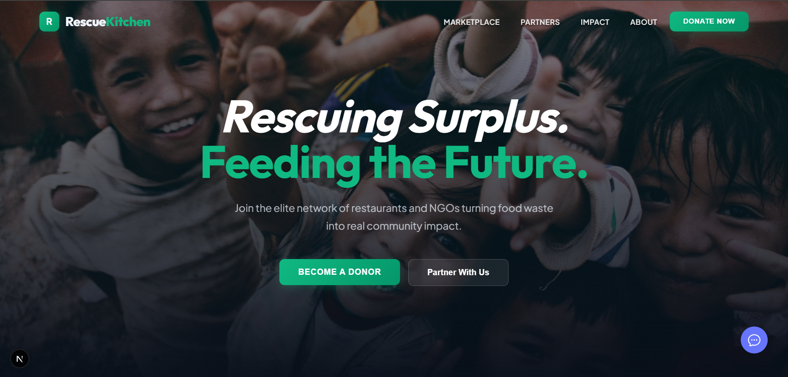

<div align="center">
  

  # 🍽️ RescueKitchen
  
  **Rescuing Surplus. Feeding the Future.**
  
  [](https://nextjs.org/)
  [](https://tailwindcss.com/)
  [](https://reactjs.org/)

  *An elite network of restaurants and NGOs turning food waste into real community impact, powered by a Dark Luxury design system.*
</div>

---

## ✨ Overview

In a world of abundance, hunger is a logistical failure. **RescueKitchen** is the bridge. We leverage real-time data to ensure that perfectly good food reaches the plates of those who need it most, reducing carbon footprints and nourishing lives.

Designed with a premium, **"Dark Luxury"** aesthetic, RescueKitchen offers a high-end, immersive user experience tailored to seamless logistics and impactful engagement.

## 🚀 Key Features

- **Surplus Food Marketplace:** Real-time matching between restaurants with surplus and NGOs in need.
- **Dark Luxury UI/UX:** A highly polished, immersive aesthetic featuring sleek glassmorphism and modern layouts.
- **Intelligent Chatbot:** An integrated AI chatbot providing support and streamlined navigation.
- **Logistics Tracking:** End-to-end transparency ensuring food reaches its destination safely.
- **Carbon Offset Rewards:** Gamified tracking and certificates for contributing restaurants.

## 🛠️ Tech Stack

- **Framework:** [Next.js](https://nextjs.org/)
- **UI & Styling:** [Tailwind CSS](https://tailwindcss.com/) (Dark Luxury Theme)
- **Icons & Assets:** Font Awesome, Unsplash

## 💻 Getting Started

First, run the development server:

```bash
npm run dev
# or
yarn dev
# or
pnpm dev
# or
bun dev
```

Open [http://localhost:3000](http://localhost:3000) with your browser to see the result.

## 🤝 Contributing

Contributions are welcome! If you're passionate about ending food waste, please fork this repository and submit a pull request.
